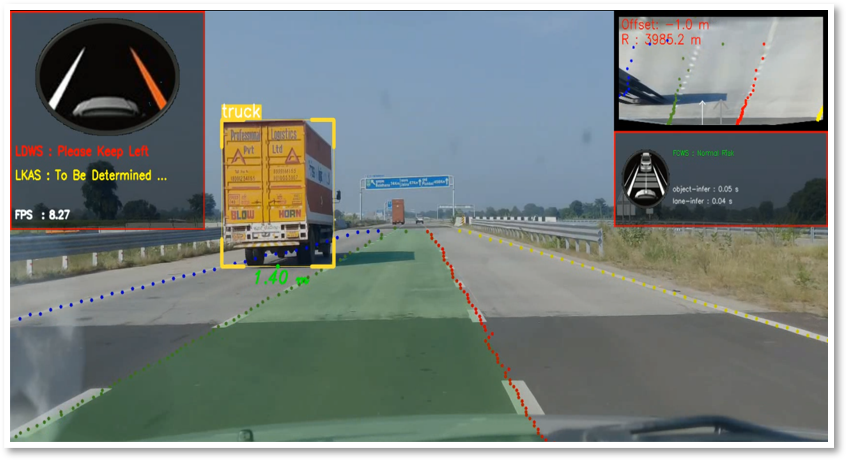

# 🚗 LDWS & Object Detection — Driving Assistance Prototype

[](https://github.com/ChinmayBitne/LDWS-and-Object-Detection/stargazers)
[](./LICENSE)
[](https://www.python.org/)
[](https://github.com/ChinmayBitne/LDWS-and-Object-Detection/issues)
[](https://github.com/ChinmayBitne/LDWS-and-Object-Detection)
[](https://codecov.io/gh/ChinmayBitne/LDWS-and-Object-Detection)

A research prototype combining lane detection (LDWS) with object detection to visualize lane lines, estimate lateral offset, detect road objects, estimate approximate distance, and provide on-screen warnings and a simulated ADAS overlay.

🖼️ Demo
----
This is a representative frame captured during inference showing lane lines, the detected truck, the green lane mask and the overlay panels.



⚡ Quick Start
-----------
1. Clone:
   ```bash
   git clone https://github.com/ChinmayBitne/LDWS-and-Object-Detection.git
   cd LDWS-and-Object-Detection
   ```

2. Create and activate a virtual environment:
   ```bash
   python -m venv venv
   source venv/bin/activate      # Windows: venv\Scripts\activate
   ```

3. Install dependencies (recommended):
   - If a `requirements.txt` exists:
     ```bash
     pip install -r requirements.txt
     ```
   - Minimal packages (adjust to your needs / platform):
     ```bash
     pip install opencv-python numpy scipy pillow onnxruntime
     ```
   - For TensorRT (.trt) support, install NVIDIA TensorRT & matching Python bindings and CUDA drivers as required by your platform.

4. Prepare models and labels:
   - Lane detector (ONNX or TRT): e.g. `LaneDetection/models/culane_res34.trt`
   - Object detector (ONNX or TRT): e.g. `ObjectDetection/models/Detection.trt`
   - Class names (labels): `ObjectDetection/models/coco_label.txt`

5. Run the app:
   ```bash
   python main.py
   ```
   - A small GUI opens to select File / Webcam / IP Camera.
   - Processed video is saved to `./Output/<timestamp>.mp4` automatically.

🧠 Primary features
----------------
- Ultrafast lane detection (UltrafastLaneDetector and UltrafastLaneDetectorV2) — ONNX/TensorRT backends.
- YOLO-style object detection (YoloDetector) with ONNX and TensorRT support.
- Single-camera distance estimation (approximate) and collision-in-path checks.
- Visual overlays: lane mask, lane line points, bounding boxes, class labels, distance text, and UI panels showing LDWS / FCWS statuses.
- GUI for selecting input source (VideoPath.py) and auto-output recording.

🛠️ Configuration
-------------
Primary settings are near the top of `main.py`. Example config snippets:

- lane_config:
```python
lane_config = {
    "model_path": "./LaneDetection/models/culane_res34.trt",
    "model_type" : LaneModelType.UFLDV2_CULANE
}
```

- object_config:
```python
object_config = {
    "model_path": './ObjectDetection/models/Detection.trt',
    "model_type": ObjectModelType.YOLOV8,
    "classes_path": './ObjectDetection/models/coco_label.txt',
    "box_score": 0.4,
    "box_nms_iou": 0.45
}
```

🧾 Supported model formats
-----------------------
- Lane detector: ONNX (.onnx) or TensorRT engine (.trt).
- Object detector: ONNX (.onnx) or TensorRT engine (.trt).
- The loader auto-switches based on extensions and available runtimes.

📁 Important files & structure
--------------------------
- `main.py` — application entrypoint and main processing loop (GUI + ADAS simulation window).
- `VideoPath.py` — GUI for selecting video source (file / webcam / IP camera).
- `ObjectDetection/yoloDetector.py` — object detector with ONNX/TensorRT support and visualization helpers.
- `ObjectDetection/distanceMeasure.py` — single-camera distance estimation and collision detection helpers.
- `LaneDetection/ultrafastLaneDetector/` — lane detector implementations, utils and export helpers.
- `assets/` — overlay icons and UI images (place demo_frame.jpg here).
- `Output/` — output mp4 files are written here.

🎯 Usage tips
----------
- Use TensorRT (.trt) models on NVIDIA GPUs for best FPS.
- Lower input resolution to increase frame rate if needed (trade-off with detection accuracy).
- Tune `box_score` and `box_nms_iou` to adjust detector confidence and suppression.
- Calibrate distance estimation constants (focal length and reference object sizes) for your camera setup to improve accuracy.

⚠️ Limitations & safety notice
---------------------------
- Prototype / academic use only. This is NOT a certified vehicle safety system.
- Distance estimates are approximate (single-camera) and may vary significantly with camera calibration and perspective.
- Accuracy degrades in poor lighting, heavy rain, snow, glare, and occlusions.
- Do not use for real driving decisions without extensive validation and certification.

🤝 Contributing
------------
Contributions, bug reports and improvements are welcome:
1. Fork the repo and create a branch for your change.
2. Add tests or validation notes for behavioral changes.
3. Open a pull request with a clear description.


🙌 Acknowledgements
----------------
Thanks to the open-source vision and detection community — Ultrafast lane detection approaches, YOLO family detectors, OpenCV and NVIDIA TensorRT examples inspired and informed this project.